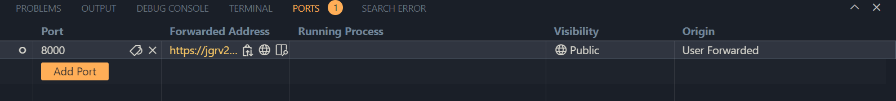
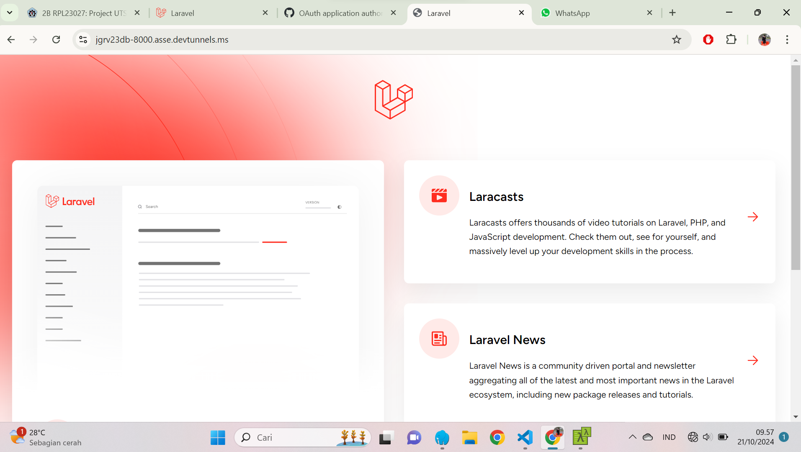

NAMA : MOH. ARBI ARDIANSYAH

NIM : 362358302150

KELAS : 2B TRPL

TUGAS UTS SEMESTER 3 

1.Validasi Tambahan
Untuk menambahkan validasi bahwa nama buku tidak boleh kosong dan harga minimal Rp 1.000, saya memodifikasi validasi di dalam BukuController

2.Merancang Endpoint Baru untuk Pencarian Buku Berdasarkan Kategori atau Judul

Saya Menambahkan metode baru bernama search di dalam BukuController.php.

Saya Menambahkan route untuk mencari buku

Hasil di Postman

3.Uji API Secara Publik:
saya menggunakan port di visual code

ini link api secara publik : https://jgrv23db-8000.asse.devtunnels.ms/